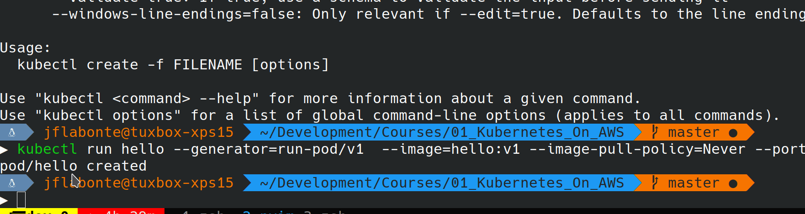

# Up and Running - HelloWorld

This is an up and running from your development machine.

## Requirements

1. kubectl
2. VM Manager:
   * VirtualBox
   * KVM
   * VMWare
   * or any other I guess
3. minikube
4. Docker
   * On your dev machine

## Install kubectl

I am running Linux so I will stick to Linux install:

```bash
curl -LO https://storage.googleapis.com/kubernetes-release/release/`curl -s https://storage.googleapis.com/kubernetes-release/release/stable.txt`/bin/linux/amd64/kubectl
chmod +x kubectl
sudo mv kubectl /usr/local/bin/kubectl
```

## Install VirtualBox

```bash
sudo apt install virtualbox virtualbox-ext-pack -y
```

## Install minikube

```bash
wget https://github.com/kubernetes/minikube/releases/download/v1.6.2/minikube_1.6.2.deb
sudo gdebi minikube*.deb
```

## Time to play with Kubernetes:

Create a Docker image for the sake for the example:

```dockerfile
from nginx:alpine
RUN echo "<h1>Hello From Minikube</h1>" > /usr/share/nginx/html/index.html
```

To change where the docker deamon is going to run from ( Open a second terminal and test some docker commands to see the difference):

```bash
eval $(minikube docker-env)
```

Then you can build your nginx image inside minikube:

```bash
docker build -t hello:v1 .
```

Now the kubernetes part. You need to change `kubectl` context using the following command:

```bash
kubectl config use-context minikube
```

Now we are going to interact with your `minikube` VM using `kubectl`

### Create a POD on the fly

The deprecated way shown in the book:

```bash
kubectl run hello --image=hello:v1 --image-pull-policy=Never --port=80
```

The new version of it is with an extra flat to override the default `--generator` flag.

```bash
 kubectl run hello --generator=run-pod/v1  --image=hello:v1 --image-pull-policy=Never --port=80
```

At that point you should have a pod running:

```bash
kubectl get pods
```

You should see the following:


